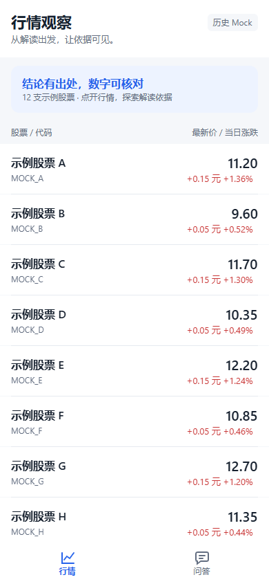
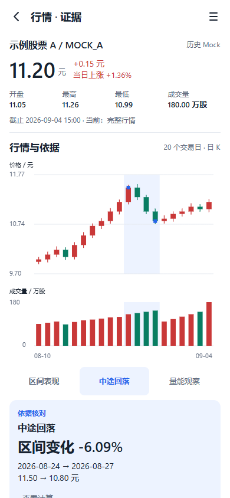
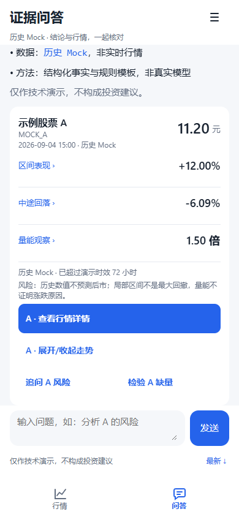

# 新版画面与演示

2026-09-13，业务 c25eeed；全部来自实际 H5 页面，确定性历史 Mock。应用以 390×844 录制，视频外框 520×1020；画面外字幕解释操作，无音频。

| 演示 | 时长 | 核心操作 |
|---|---:|---|
| [Task 1 视频](task1.webm) · [文字稿](../submit/TASK1-VIDEO.md) | 88.44 秒 | 结论→区间→交易日→公式→缺量→另一股票复用→失败恢复 |
| [Task 2 视频](task2.webm) · [文字稿](../submit/TASK2-VIDEO.md) | 92.64 秒 | 问答卡→同快照详情→比较→带上下文追问/草稿→缺量→原位重试→共享图表 |

GitHub 对 WebM 的内嵌呈现因浏览器而异；文件链接可直接打开或下载，文字稿可独立阅读。公开素材只使用仓库相对路径，不依赖本机缓存。最终公开可访问性仍以正确代码版本同步后的匿名检查为准。

| 行情 | 详情 | 问答 |
|---|---|---|
|  |  |  |

补充画面：[展开计算](calculation.png) · [缺量边界](missing.png) · [320 宽](chat-320.png) · [430 宽](chat-430.png) · [1024 居中容器](chat-desktop.png)。

[设计参考与取舍](DESIGN.md) · [测试与截图证据](../evidence/task2/README.md) · [本地交付与公开入口状态](../submit/DELIVERY.md)。Android 仅构建通过，物理设备、原生键盘、iOS 和 HarmonyOS 未运行验证；手机尺寸 H5 不代表真机部署。
