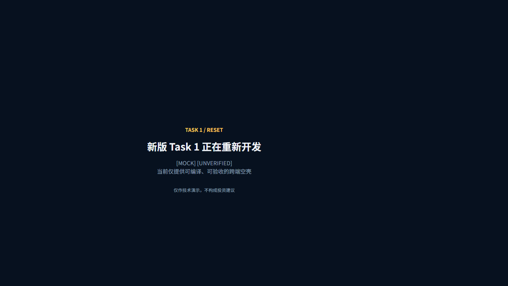

# 2026-08-19 Codex 主开发与 Task 1 reset 证据

## 基线与范围

- 基线：`feature/learning-workflow@ab8675d3fa377486d492c39f320745314ec71467`
- 实施分支：`feature/codex-primary-reset`
- 旧实现：迁入 `archive/task1-v1/`
- 活动实现：`KuiklyChart`、`shared`、`androidApp`、`h5App` 最小空壳

## 归档隔离

- 归档 Git 文件数：32。
- 归档中命中的 build/cache/node_modules/APK/密钥类已跟踪文件：0。
- `settings.gradle.kts`、根 build、CI、`verify.ps1`、`run-h5.ps1` 对 `archive/task1-v1` 的引用：0。
- 活动四模块对旧 `LineChart`、`BarChart`、`CandleChart`、`MarketDataSource`、`AnalysisProvider`、`stock_detail` 的引用：0。

## CLI 环境

执行：

```powershell
.\scripts\doctor.ps1
```

结果：`CLI_ENV_OK`。

- JDK：17.0.12
- Node.js：24.12.0
- npm：11.6.2
- Gradle Wrapper：8.0
- Android SDK：Build Tools 30.0.3、platform-tools、platforms 33/34
- E 盘可用空间：74.1 GB

## 自动门禁

执行：

```powershell
.\scripts\verify.ps1
```

结果：exit 0。

- `:KuiklyChart:jsNodeTest`：初版曾由标记测试通过；审阅删除无业务价值测试后任务为 `SKIPPED`，空壳当前没有图表行为可测。
- `:shared:compileKotlinJs`：通过。
- `:h5App:jsBrowserProductionWebpack`：通过，JS/H5 阶段 `BUILD SUCCESSFUL in 2m 50s`。
- `:shared:testDebugUnitTest`：通过。
- `:androidApp:assembleDebug`：通过，Android 阶段 `BUILD SUCCESSFUL in 1m 43s`。

已知非阻塞警告：Webpack bundle 347 KiB 超过推荐值；AGP 7.4.2 只测试到 compileSdk 33，而工程使用 34。

## Android 产物

- 路径：`androidApp/build/outputs/apk/debug/androidApp-debug.apk`
- 审阅修复后大小：6,401,804 bytes
- 审阅修复后 SHA-256：`35C59BDFB0F113A19303F00F5C2E021D6F12CEA8C6D12AAC87A6ECA0F54E96A4`
- 状态：Debug APK 构建通过；ADB、真机和模拟器未执行。

## H5 服务与视觉边界

执行 `scripts\run-h5.ps1` 后，Webpack dev server 在 `http://localhost:8080/` 编译成功；HTTP 探针返回 200，并读到 `Kuikly Task 1 Reset` 与 `INITIALIZING TASK 1 RESET`。

浏览器可视检查未完成：Browser 连接报 `Trusted RPC dependency must resolve within a configured trusted code path`。这是浏览器控制插件的受信任路径错误，不是 Gradle 或 H5 编译失败。当前只能声明 H5 bundle 与本地服务通过，不能声明页面已完成可视运行验收。

## 外部操作

- 未推送、未合并、未创建 PR、未发布、未发送外部消息。
- 未启动 OpenCode 或 WorkBuddy。

## 审阅修复回归

双轴审阅后执行 `git diff --check` 与完整 `scripts\verify.ps1`，结果 exit 0：

- JS/shared/H5 阶段：`BUILD SUCCESSFUL in 43s`。
- Android JVM/APK 阶段：`BUILD SUCCESSFUL in 48s`。
- `Task1Routes.FINANCE_HOME` 成为宿主和共享页唯一入口常量；活动源码只剩定义与合同测试中的两个 `finance_home` 字面量。
- 活动源码对旧图表、行情 Provider 和 `stock_detail` 的引用仍为 0。

## H5 可视验收补充 · 2026-08-19 20:16–20:23 +08:00

### 环境与启动

- 分支：`feature/codex-primary-reset`；活动源码基线仍为 `f5014c6`，其后的 `ddf83e6` 只校正题面文档。
- 执行：`scripts\run-h5.ps1`。
- 结果：`:h5App:jsBrowserDevelopmentRun` 为 `BUILD SUCCESSFUL in 27s`；webpack 5.93.0 在 `http://localhost:8080/` 编译成功。
- 应用内 Browser 仍报 `Trusted RPC dependency must resolve within a configured trusted code path`；因此改用 Playwright CLI 0.1.18 驱动已安装的 Microsoft Edge 151.0.4129.93。该故障仍只属于浏览器控制插件，不属于 H5 runtime。

### 真实浏览器结果

- viewport：1280 × 720；标题：`Kuikly Task 1 Reset`。
- 可见文本：`TASK 1 / RESET`、`新版 Task 1 正在重新开发`、`[MOCK] [UNVERIFIED]`、`当前仅提供可编译、可验收的跨端空壳`、`仅作技术演示，不构成投资建议`。
- DOM：body 首个元素为 `root`，`root.childElementCount = 1`；body 第二个元素为 `SCRIPT`，证明启动 `boot` 占位已移除。
- Network：`GET /` → 200；`GET /h5App.js` → 200；没有行情、AI 或其他远程业务请求。
- Console：Kuikly 记录 page create、render finish 与 first frame；唯一 error 是 `/favicon.ico` 404，不影响页面创建、挂载或首帧，记录为非阻塞静态资源缺口。

### 截图



- 文件：`docs/evidence/assets/2026-08-19-t1-000-h5-reset.png`
- 大小：23,975 bytes
- SHA-256：`DC5099F9A80ACDD28DC32535F8810006F657BEEE8627E247349D7B71C538AD0D`

### 同轮自动门禁

- `scripts\doctor.ps1`：`CLI_ENV_OK`；JDK 17.0.12、Node 24.12.0、npm 11.6.2、Gradle 8.0、Android SDK 33/34 可用。
- `scripts\verify.ps1`：exit 0。
  - JS/shared/H5：`BUILD SUCCESSFUL in 18s`；`KuiklyChart:jsNodeTest` 仍为 `SKIPPED`，不解释为图表证据。
  - Android JVM/APK：`BUILD SUCCESSFUL in 14s`。
  - APK：6,401,804 bytes；SHA-256 `35C59BDFB0F113A19303F00F5C2E021D6F12CEA8C6D12AAC87A6ECA0F54E96A4`。
- H5 服务与临时浏览器会话已正常关闭，8080 端口无 listener。

### 裁决

- `T1-000 = VERIFIED`；`WF-003 = VERIFIED`。
- 该证据只证明 reset scaffold 的 code/tests/evidence/learning 四门及 H5 实际渲染，不证明行情列表、个股详情、AI 分析、图表或 Task 2 已实现。
- Android 设备运行、iOS、HarmonyOS 仍未执行，不得写成已支持。
